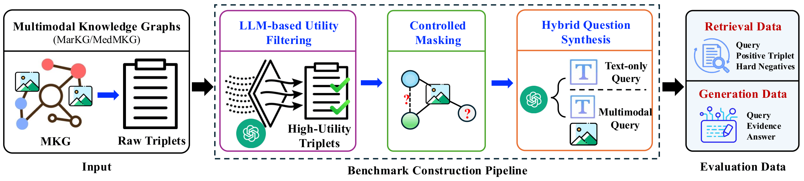

# MKG-RAG-Bench

Official code for the paper "MKG-RAG-Bench: Benchmarking Retrieval in Multimodal Knowledge Graph-Augmented Generation" by Xiaochen Wang, Bao Hoang, Han Liu, Ting Wang, and Fenglong Ma, KDD 2026.

## Links
- 📄 [Paper](https://arxiv.org/pdf/2606.26458)
- 🎥 [Presentation Video](https://www.youtube.com/watch?v=PHsanrbK0ME)


## Overview



Retrieval-augmented generation (RAG) over knowledge graphs has emerged as a promising approach for grounding large language models, yet existing benchmarks largely overlook the challenges of retrieval in multimodal knowledge graph RAG (MKG-RAG). In practice, retrieval is a critical bottleneck: multimodal knowledge is heterogeneous, difficult to align across modalities, and often poorly served by retrievers designed for unstructured corpora. To address this gap, we introduce MKG-RAG-Bench, a cross-domain benchmark explicitly designed to evaluate retrieval in MKG-RAG. MKG-RAG-Bench is constructed from two multimodal knowledge graphs spanning general and medical domains, and includes carefully aligned question-answering datasets that support controlled evaluation of both retrieval and downstream generation. The benchmark is built using an LLM-based curation pipeline that filters low-utility knowledge, generates structurally grounded queries with exact supervision, and systematically covers diverse modality configurations. Through extensive experiments across representative retriever families and modality settings, we show that effective multimodal retrieval remains challenging yet crucial for end-to-end MKG-RAG performance, and that retrieval quality strongly determines generation outcomes. By isolating retrieval as a first-class evaluation target, MKG-RAG-Bench provides a principled foundation for diagnosing current limitations and advancing multimodal knowledge graph RAG systems.

## Datasets

We provide two subsets: MKG-RAG-Bench-G and MKG-RAG-Bench-M, covering the general and medical domains, respectively.

The datasets are split into training, validation, and test sets at an 8:1:1 ratio, supporting evaluation of both retrieval and generation.

| Dataset | Split | Queries | Multimodal Queries | Triplets | Multimodal Triplets | Answers |
|---|---|---:|---:|---:|---:|---:|
| MKG-RAG-Bench-G | Train | 48,908 | 30.1% | 25,517 | 28.8% | 61,001 |
| MKG-RAG-Bench-G | Validation | 6,113 | 31.0% | 25,517 | 28.8% | 7,586 |
| MKG-RAG-Bench-G | Test | 6,115 | 30.3% | 25,517 | 28.8% | 7,795 |
| MKG-RAG-Bench-M | Train | 4,781 | 40.6% | 18,468 | 49.0% | 16,564 |
| MKG-RAG-Bench-M | Validation | 597 | 42.2% | 18,468 | 49.0% | 2,030 |
| MKG-RAG-Bench-M | Test | 599 | 43.1% | 18,468 | 49.0% | 2,074 |

## Baselines

The retrieval evaluation assesses several techniques, including text-only, fusion-based multimodal, captioning-based, and reranking-based retrievers. We also include a random retriever as a simple lower-bound baseline. For a fair comparison, all retrievers use a shared CLIP encoder to obtain unified representations, while captioning-based retrievers additionally use a BLIP model. Queries and candidate triplets are embedded in the same representation space, and candidates are ranked by cosine similarity. We report standard retrieval metrics, including NDCG@𝐾, Precision@𝐾, and Recall@𝐾.

## Acknowledgements

This research was partially supported by a 2025/2026 Rising Researcher Grant from Penn State’s Institute for Computational &Data Sciences (RRID:SCR_025154) and the National Science Foundation under Grant No. 2333790 and 2238275.
<!--

## ScienceQA Folder
Reference: [https://github.com/lupantech/ScienceQA](https://github.com/lupantech/ScienceQA)

To use GPT, prepare your API key:
```
export OPENAI_API_KEY="your_api_key_here"
```

To run GPT model it will store results in folder `results`
```
python3 run_gpt.py
```

Or 
```
python3 run_multimodal_gpt.py
```

Please remember to change `test_number` in `args` to -1 in `run_gpt.py` and `run_multimodal_gpt.py` when running full experiment.

Note:
- `run_gpt.py` use image's caption as input.
- `run_multimodal_gpt.py` use image as input.


## MedicalVQA Folder
Reference: [https://github.com/XiaochenWang-PSU/MedMKG](https://github.com/XiaochenWang-PSU/MedMKG)


To use GPT, prepare your API key:
```
export OPENAI_API_KEY="your_api_key_here"
```

To run GPT model
```
python3 run_gpt.py
```

## MKG_Analogy Folder
Reference: [https://github.com/zjunlp/MKG_Analogy](https://github.com/zjunlp/MKG_Analogy)

To use GPT, prepare your API key:
```
export OPENAI_API_KEY="your_api_key_here"
```

To run GPT model
```
python3 run_gpt.py
```

## FactVQA Folder
Reference: [https://github.com/wangpengnorman/FVQA](https://github.com/wangpengnorman/FVQA)

To use GPT, prepare your API key:
```
export OPENAI_API_KEY="your_api_key_here"
```

To run GPT model
```
python3 run_gpt.py
```

## Useful Resources

### Papers:

#### General Graph RAG
- Knowledge Graph-Guided Retrieval Augmented Generation, NACCL 2025 [[Paper](https://arxiv.org/pdf/2502.06864)][[Code](https://github.com/nju-websoft/KG2RAG/tree/main)]: Given a query, KG2RAG first extracts ⟨h, r, t⟩ triples from the corpus using an LLM prompt (similar to Xiaochen's paper). It then retrieves the top-k semantic seeds via cosine similarity in an embedding space, followed by graph-guided expansion using m-hop BFS from those seeds. Finally, it applies a reranker and graph filtering (e.g., per-component maximum spanning trees) to produce a robust subgraph and context for the LLM.
- From Local to Global: A GraphRAG Approach to Query-Focused Summarization, Microsoft Research [[Paper](https://arxiv.org/pdf/2404.16130)][[Code](https://github.com/microsoft/graphrag)]

#### Healthcare Application
- RULE: Reliable Multimodal RAG for Factuality in Medical Vision Language Models [[Paper](https://arxiv.org/pdf/2407.05131)][[Code](https://github.com/richard-peng-xia/RULE)]: RULE introduces a two-part framework to improve factual accuracy in Medical Large Vision Language Models (Med-LVLMs): (1) a statistical calibration method that adaptively selects the optimal number of retrieved contexts to control factuality risk, and (2) knowledge-balanced preference tuning that fine-tunes models on curated samples where retrieval caused errors, reducing over-reliance on external references (DPO).
- Fact-Aware Multimodal Retrieval Augmentation for Accurate Medical Radiology Report Generation [[Paper](https://arxiv.org/pdf/2407.15268)][[Code](https://github.com/cxcscmu/FactMM-RAG)]: [RadGraph](https://arxiv.org/abs/2106.14463) is used to annotate reports and mine factually consistent pairs, which are then employed to train a [MARVEL](https://arxiv.org/abs/2310.14037)-based multimodal retriever with contrastive learning to align images and text. At inference, given a new chest X-ray, the retriever selects the most factually relevant report, and both the image and retrieved report are passed into LLaVA for retrieval-augmented generation, improving factual correctness in the final radiology report.


-->


